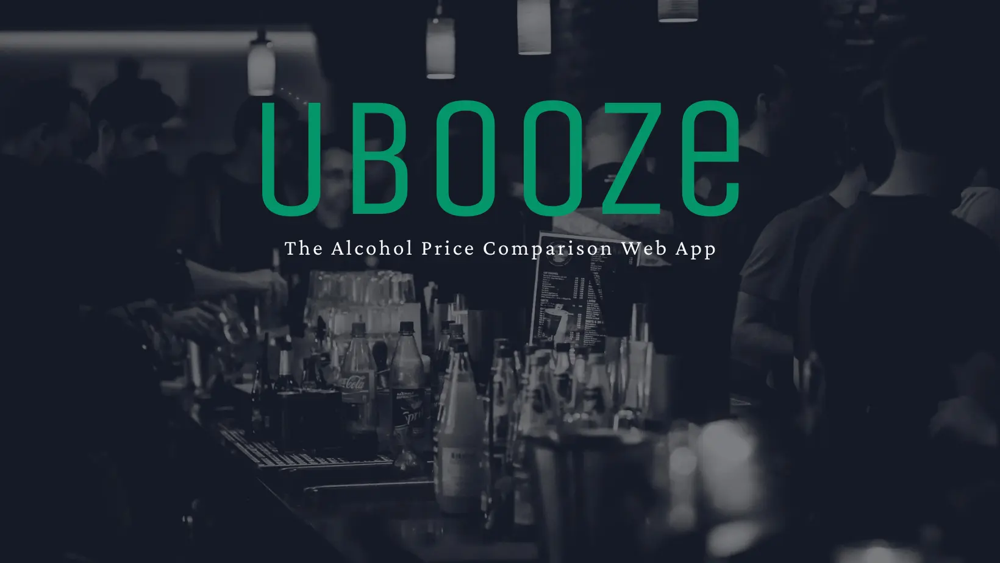

Alcohol is expensive. That's why I created uBooze -- a price comparison website for alcohol prices at your local supermarkets.
Simply type in your postcode and see what drinks are cheapest near you.

Also includes full login/register functionality for user account (as well as Facebook and Google sign ins), for the ability to favourite products and create your own public favourite alcohol pages, for easy access to your favourite product price comparisons in the future.

(Note: This readme is still under construction and instructions will not currently work, as uBooze also relies on database configuration and environment variables currently not listed. But they will be! Very soon.)

## Technologies Used

Frontend:

- Next.js
- Redux
- React Hook Form
- React Query
- Tailwind CSS
- Framer Motion

Backend:

- Node.js
- Express.js
- Passport.js
- bcrypt
- JSON Web Tokens
- OAuth,
- Axios,
- Puppeteer,
- Cheerio,
- SendGrid

## Run Locally

Clone the project

```bash
  git clone https://github.com/vitamins999/ubooze.git
```

Go to the project directory

```bash
  cd ubooze
```

Install dependencies for backend

```bash
  npm install
```

Install dependencies for frontend

```bash
  cd client
  npm install
```

Start the server (make sure you're in the root folder)

```bash
  npm run dev
```

## Authors

- [Jools Barnett](https://www.github.com/vitamins999)
