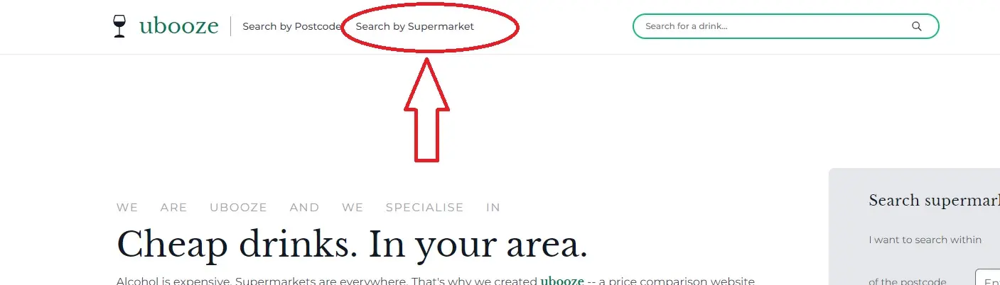
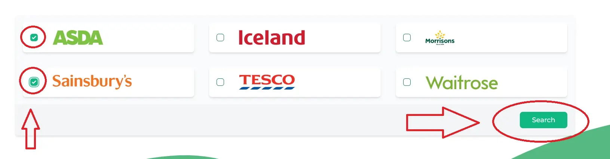
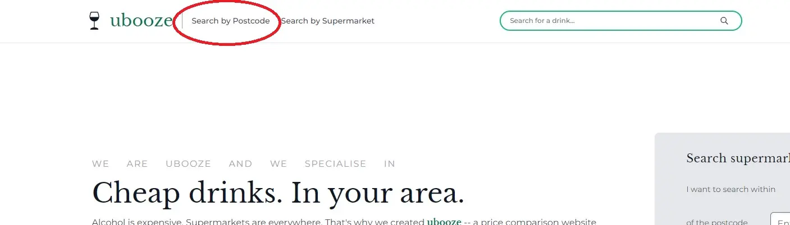
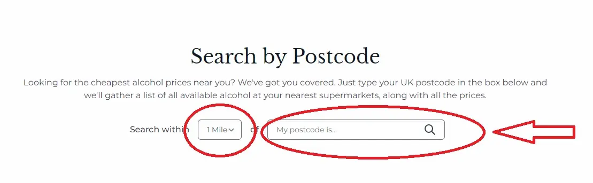
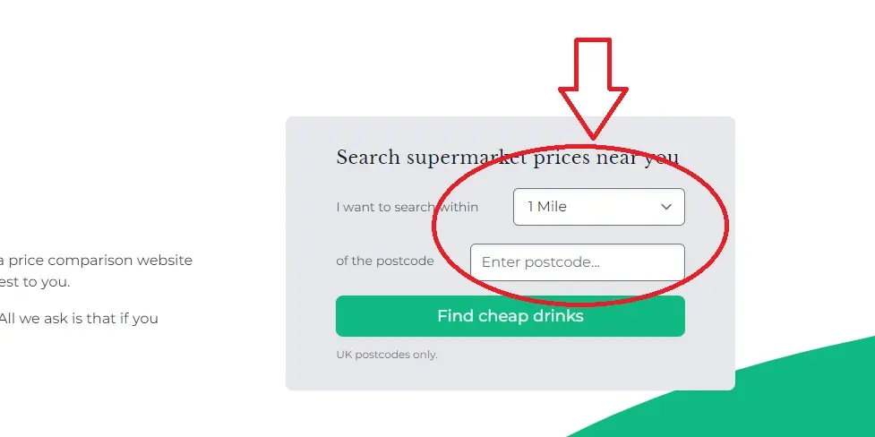
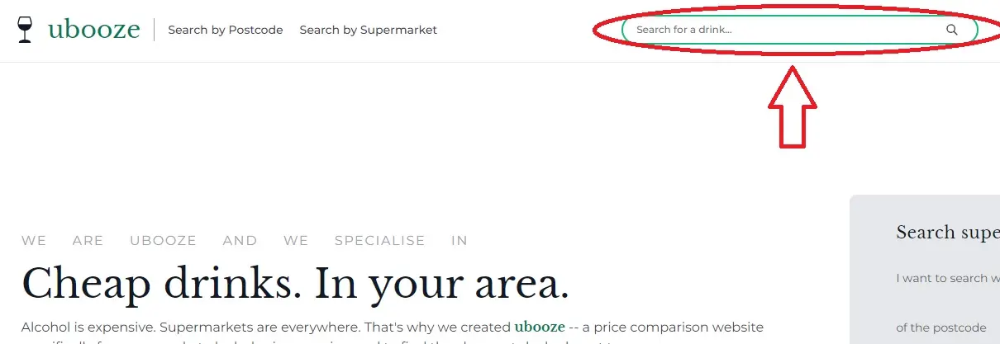

Alcohol is expensive. That's why I created Ubooze -- a price comparison website for alcohol prices at your local UK supermarkets.
Simply type in your postcode and see what drinks are cheapest near you.

Don't care about finding local prices? No problem. Ubooze also includes the ability to let the user select which supermarkets they want to compare against each other. No postcode necessary.

And that's not all.

The Ubooze website also includes full login/register functionality for user accounts (as well as Facebook and Google sign ins through OAuth), allowing users to favourite products and create their own public favourite alcohol pages, for easy access to their favourite product price comparisons in the future.

## Table of Contents <!-- omit in toc -->

- [Website](#website)
- [Repositories](#repositories)
- [Why Does This Exist?](#why-does-this-exist)
- [How Does It Work?](#how-does-it-work)
- [Technologies Used](#technologies-used)
- [How To Use](#how-to-use)
  - [Search By Supermarket](#search-by-supermarket)
  - [Search By Postcode](#search-by-postcode)
  - [Search By Product](#search-by-product)
- [Run Locally](#run-locally)
- [Environment Variables](#environment-variables)
- [Acknowledgements](#acknowledgements)
- [Authors](#authors)

## Website

[Live Website]() - Not currently online yet. Stay tuned!

## Repositories

Ubooze functions through the use of two repositories:

1. The Web App (this repo)
2. The Supermarket Webscraper Utility ([found here](https://github.com/vitamins999/ubooze-scraper))

The Ubooze Supermarket Scraper Utility is a custom made Node.js web scraper for UK supermarket alcohol prices, with PostgreSQL database integration for insertion and updating of those prices.

The scraper is intended for use with the uBooze web app (this repository), in order keep the website's database up to date, with the most recent alcohol prices and offers.

It uses Node.js to run in the command line.

For more information, please refer to the [Ubooze Web Scraper Repository](https://github.com/vitamins999/ubooze-scraper).

## Why Does This Exist?

As I already mentioned above, alcohol is expensive. It is also something that routinely changes price quite dramatically from shop to shop, further complicated by any special offers offered by these shops.

Due to this high level of expense, it also means that saving money on alcohol will have a greater effect on an overall shopping bill than saving money on most other food related products. Something of keen interest to financial trying times, like... well, right now.

So wouldn't it be nice if there was a website to compare alcohol prices across supermarkets at a glance?

Enter Ubooze.

I conducted extensive market research, and discovered that not only was there both a need and a gap in the market for this product, but prospective users also valued supermarkets that were closer to them over supermarkets further away.

This lead to the final piece of the puzzle -- a price comparison website for supermarket alcohol prices where the user could either:

1. Select which supermarkets to compare; or
2. Enter a radius and a postcode, and compare supermarkets only found within that radius.

## How Does It Work?

Ubooze is made up of two distinct parts:

1. A full stack Web App with REST API (this repo)
2. A custom made Web Scraper Utility ([found here](https://github.com/vitamins999/ubooze-scraper))

The web scraper utility is a Node.js program that runs in the command line, which the website admin runs in order to populate the database, whenever they feel it appropriate. Its purpose is to scrape current alcohol prices and offers from the most popular UK supermarkets' websites.

After a successful scrape, it connects to a PostgreSQL database hosted in the cloud (I decided to use [Supabase](https://www.supabase.com), due to the very generous free tier allowing me to minimise hosting costs) and updates already existing products to their new price and/or offer, or inserts new products into the database, to be manually linked up and made visible outside the database, in the future.

(For more information on the web scraper utility, please visit the repository [here](https://github.com/vitamins999/ubooze-scraper)).

The Web App is a full stack web application, utilising Next.js on the client and Express.js on the server.

When the user visits the website, they have the option of either selecting price comparison by clicking the supermarkets to compare, or having the website choose which supermarkets to compare by entering the user's postcode and a radius of 1-3 miles.

If the user selects the supermarkets to compare, a query is made to the database to select all products where the 'supermarket' field corresponds to those supermarkets.

If the user enters their postcode and a radius, a request containing the postcode is sent by the REST API on the server to the Mapbox API. This returns the latitude and longitude of the postcode. These coordinates are then sent as a request, along with the radius converted to kilometres, to the Foursquare API. This returns a JSON back to the server, of the supermarkets found within the radius of those coordinates.

The website then queries the database, as above, with this list of supermarkets.

In both case, the client receives a paginated list of items from the database, that correspond to the relevant supermarket(s).

The website also features the ability to search for a specific drink. This will query the database and return matching products from all supermarkets and their comparative prices.

Furthermore, the website also allows users to register accounts and login (along with OAuth integration for Google and Facebook). From here, they can choose to favourite a product, whereby favourited productIDs are saved in the database for that user. If they return to their favourite page in the future, a request is made to the database to return products that are found in their favourite product field, thus populating their product page with all of their favourite products.

Essentially, Ubooze is a standard CRUD full stack web app, where the database's data (with the exception of user data) is populated by a Node.js command line web scraper.

## Technologies Used

Frontend:

- Next.js
- Redux
- React Hook Form
- React Query
- Tailwind CSS
- Framer Motion

Backend:

- Node.js
- Express.js
- Passport.js
- bcrypt
- JSON Web Tokens
- OAuth
- Axios
- SendGrid
- Knex.js
- Objection.js

Database:

- PostgreSQL (hosted on [Supabase](https://supabase.com/))

Third Party APIs:

- [Mapbox](https://www.mapbox.com/)
- [Foursquare](https://foursquare.com/)

Web Scraper:

- Node.js
- Axios
- Puppeteer
- Cheerio
- Knex.js
- Objection.js

## How To Use

### Search By Supermarket

Click here in the header:



On the next page, tick the boxes for which supermarkets you want to compare and click search.



### Search By Postcode

Either click here in the header:



And then enter your postcode, radius, and click the search icon (or press Enter).



Or alternatively, enter your postcode and radius on this box on the homepage, and click "Find cheap drinks".



### Search By Product

Enter the product name in the search bar in the header. Once done, click the search icon (or press Enter).



## Run Locally

Clone the project

```bash
  git clone https://github.com/vitamins999/ubooze.git
```

Go to the project directory

```bash
  cd ubooze
```

Install dependencies for backend

```bash
  npm install
```

Install dependencies for frontend

```bash
  cd client
  npm install
```

Start the server (make sure you're in the root folder)

```bash
  npm run dev
```

## Environment Variables

To run this project, you will need to add the following environment variables to your .env file

`PORT` - Port for Express Server to run on. Defaults to 3001.

`MAPBOX_API_KEY` - An API key from [Mapbox](https://www.mapbox.com/).

`FOURSQUARE_CLIENT_ID` - An API Client ID from [Foursquare](https://foursquare.com/).

`FOURSQUARE_CLIENT_SECRET` - Your Client Secret from [Foursquare](https://foursquare.com/).

`JWT_SECRET` - JWT Secret.

`JWT_REFRESH_SECRET` - JWT Secret for Refresh Tokens.

`GOOGLE_CLIENT_ID` - OAuth: Your Google Client ID from [Google Developer Console](https://console.developers.google.com/).

`GOOGLE_CLIENT_SECRET` - OAuth: Your Google Client Secret from [Google Developer Console](https://console.developers.google.com/).

`FACEBOOK_CLIENT_ID` - OAuth: Your Facebook Client ID from [Facebook Developers](https://developers.facebook.com/).

`FACEBOOK_CLIENT_SECRET` - OAuth: Your Facebook Client Secret from [Facebook Developers](https://developers.facebook.com/).

`SENDGRID_API_KEY` - An API key from [Sendgrid](https://sendgrid.com/)

`DATABASE_URL` - Your PostgreSQL connection string URL for the Production DB (either local host or remote).

`DATABASE_URL_DEV` - Your PostgreSQL connection string URL for the Development DB (either local host or remote).

## Acknowledgements

_Ubooze_ is powered by [Mapbox](https://www.mapbox.com/) and [Foursquare](https://foursquare.com/).

## Authors

- [Jools Barnett](https://www.github.com/vitamins999)
